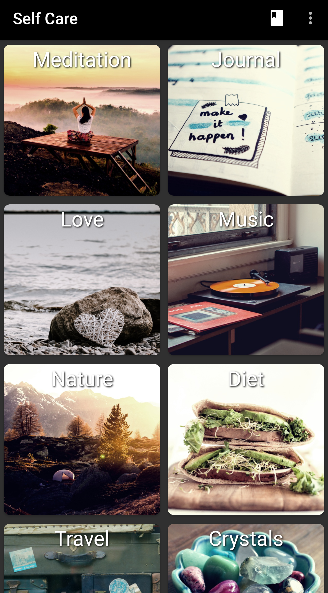
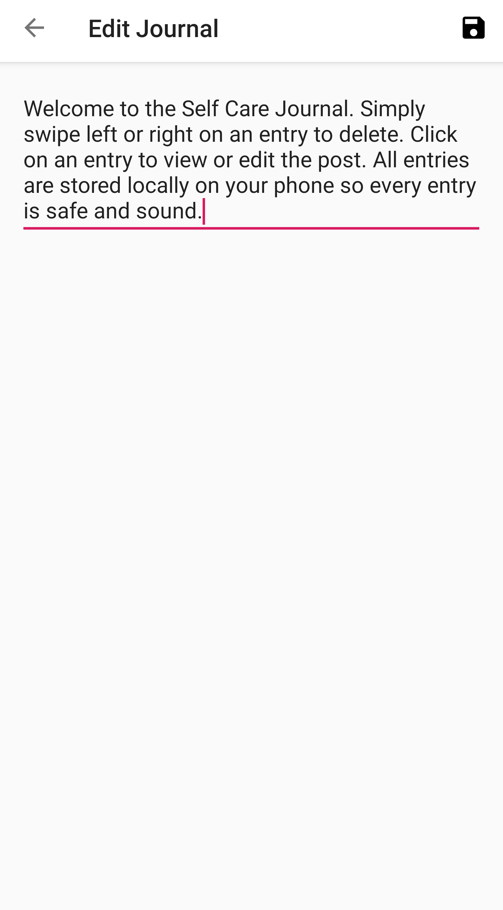
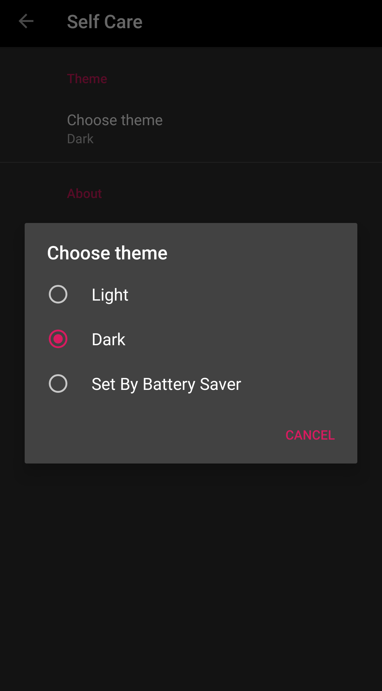

# Self Care Application Kotlin
A Kotlin implementation of the Self Care Application.

### Upcoming Features and Improvements

- [ ] Change the view journal acitivty to load the entry into a textView with an option to edit
- [ ] Add markdown support
- [ ] Continue implementing features in settings such as font, font size, etc
- [ ] Implement an undo Snackbar on swipe deletion of journal entry
- [ ] Animate the cardView of a journal entry on swipe deletion such as changing to a red color or adding a color/icon behind the card

# License
Copyright 2019 Matthew Stulz

Licensed under the Apache License, Version 2.0 (the "License"); you may not use this file except in compliance with the License. You may obtain a copy of the License at

http://www.apache.org/licenses/LICENSE-2.0

Unless required by applicable law or agreed to in writing, software distributed under the License is distributed on an "AS IS" BASIS, WITHOUT WARRANTIES OR CONDITIONS OF ANY KIND, either express or implied. See the License for the specific language governing permissions and limitations under the License.

